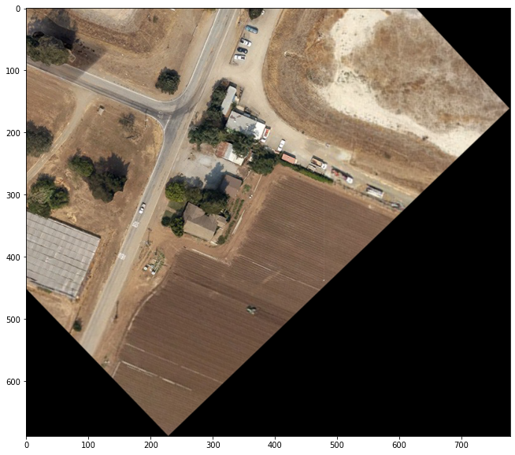

## Stitching Images with OpenCV  
 * ### Overview  
 The procedure followed is as follows :  
  - Extract the overlapping parts in the two images by detecting unique keypoints described by good feature descriptors viz. ORB (which I have used here), SIFT, SURF, BRISK, etc.
  - Then, iterate through all of them and get the most similar feature vectors.
  - Create a Homography (Image Science) which would transform the image to be pasted above the other in such a way that both appear to be taken from the same viewpoint, and same observation direction.
  - Apply the Homography and stitch them.
  - For further tuning, one may resolve lightning differences by averaging out the 2 images, but here I limit my results to the previous step.

 * Results after each stage :  
   - Detecting keypoints uniquely
  

   - Matching common keypoints :  
  

   - Applying Homography and pasting :
  

   - Cutting out excessive region :
  

 * ### Notes :  
   - The colab notebook is made available in the current directory (```image_stitching.ipynb```)
   - Other images for trying out and testing are present in ```assets``` directory

A good resource : [This Medium Blog](https://towardsdatascience.com/image-panorama-stitching-with-opencv-2402bde6b46c)
